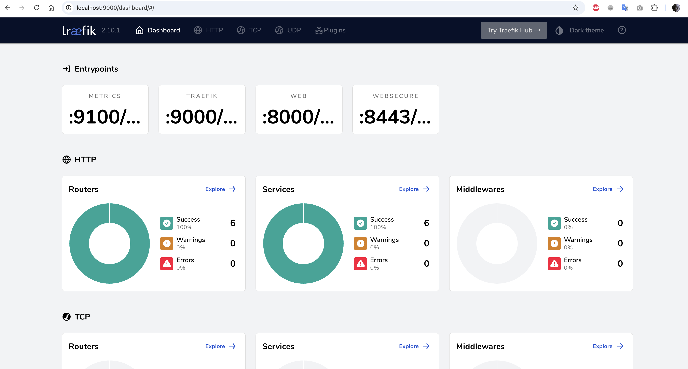

# TraefikLB

使用 [traefik](https://github.com/traefik/traefik) 作为 k8s 负载均衡器(LoadBalancer) 的 helm chart demo。

## 使用指南
- [deployment.yaml](templates/deployment.yaml) 中定义了一个后端服务 whoami，当调用该服务的 /whoami 接口时，会返回该 pod 的相关信息。
- [traefik.yaml](templates/traefik.yaml) 中配置了一条路由，当访问 traefik 该路由时，会把请求转发到它代理的 whoami 服务。 并且该路由设置了 stickySession 为 true，用于实现会话保持功能， 这样每次访问都会被转发到同一个 whoami pod上。

### 安装、销毁及更新服务
```bash
helm dependency build

helm --kubeconfig ~/Desktop/values/shanghai-ai-kubeconfig -n jasinxie install test .
helm --kubeconfig ~/Desktop/values/shanghai-ai-kubeconfig -n jasinxie uninstall test
helm --kubeconfig ~/Desktop/values/shanghai-ai-kubeconfig -n jasinxie upgrade --install test .
```

### 测试会话保持功能
使用下面命令测试 traefik 会话保持功能的有效性（需要先把traefik Service 8000 端口 port-forward 到本地）
```bash
curl -c cookies.txt -b cookies.txt --location http://127.0.0.1:8000/whoami
```
只要 Cookie 中的 whoami_session 字段的值没变，traefik 就会把请求打到 whoami 服务同一个 pod 上。
删除本地 cookies.txt 文件，再次访问，可以看到后端 pod 被切换了。

对 whoami 服务进行扩缩容，可以看到 traefik 会自动将流量转发到新的后端 pod 上。


### 查看 traefik dashboard
把 traefik Service 9000端口 port-forward 到本地，访问 http://127.0.0.1:9000/dashboard/#/ ，可以看到 traefik dashboard。


